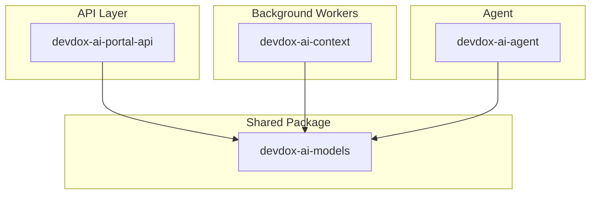
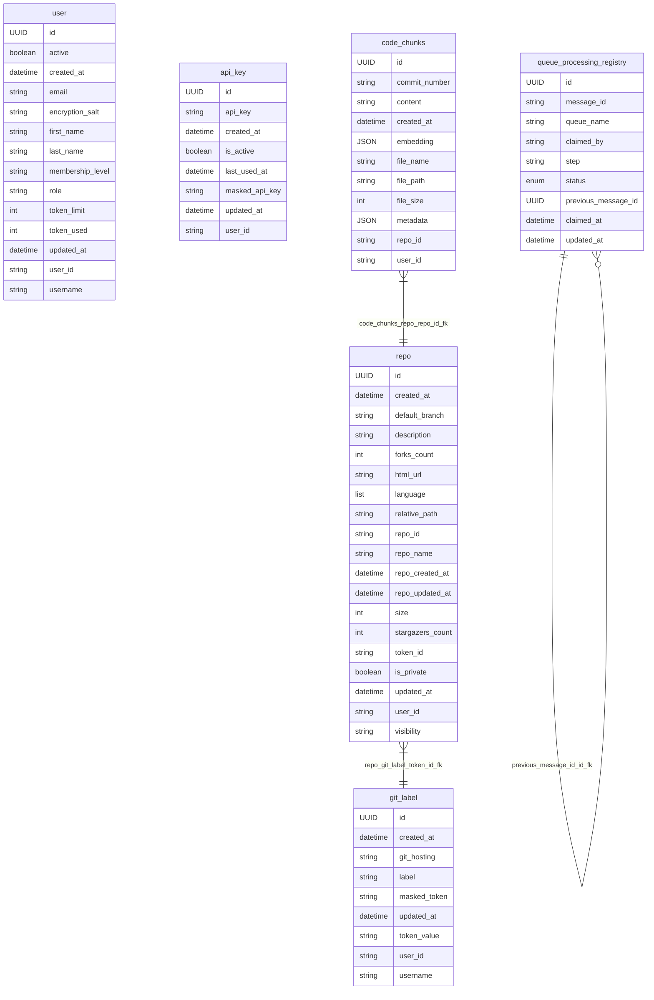

# DevDox AI Models
[](https://www.python.org/downloads/release/python-3120/)
[](https://www.postgresql.org/docs/)
[](https://tortoise.github.io/)
[](https://fastapi.tiangolo.com/)
[](https://opensource.org/licenses/MIT)

**`devdox-ai-models`** is a shared Python package that defines all database models for the DevDox AI ecosystem. It provides a single source of truth for Tortoise ORM models used across multiple microservices, ensuring consistent data schemas and eliminating duplication.

This package is designed to work with async Python applications, such as:
- API services powered by FastAPI
- Background processing workers (vanilla Python)
- Queue consumers that interact with Supabase (PostgreSQL)

---

> ⚠️ This package is **model-only**:  
> It does **not** include database initialization, migrations (e.g., Aerich), or server logic.  
> Those responsibilities live in the consumer services, like `devdox-ai-portal-api`.

---

## 📘 Table of Contents

- [📘 Features](#-features)
- [📘 Microservice Integration Map](#-microservice-integration-map)
- [📘 Directory Structure](#-directory-structure)
- [📘 Database Schema & Model Reference](#-database-schema--model-reference)
- [📘 Installation & Usage](#-installation--usage)

---

## 📘 Features

| Feature                           | Description                                                                                                      |
|-----------------------------------|------------------------------------------------------------------------------------------------------------------|
| **Centralized ORM models**        | All database models are defined in one place for consistency across services.                                    |
| **Plug-and-play integration**     | Easily usable in any service—API, worker, or CLI—that connects to the shared PostgreSQL (via Supabase or other). |
| **Lightweight and test-friendly** | No dependencies on FastAPI, Aerich, or Supabase-specific SDKs, only Tortoise ORM.                                |
| **Async-first architecture**      | full `async/await` support via Tortoise ORM.                                                                     |
| **Requires python 3.12+**         | built with python 3.12+ in mind                                                                                  |

---

## 📘 Microservice Integration Map



---

## 📘 Directory Structure

### 📄 Structure
```plaintext
devdox-ai-models/
├── models/
│   ├── __init__.py                             # Must use to define the imports properly after each model addition   
│   └── ...(all model definitions go here)...
├── utils/
│   └── database.py
├── pyproject.toml
├── README.md
└── ...
```

### 📄 File Descriptions

#### ➤ `models/__init__.py`
This file acts as the canonical export list of all models, constants, and registration logic in the `devdox-ai-models` package.

It does three critical things:

1. Explicitly Exposes Models for Import
    - Any microservice importing models from this package (e.g. from devdox_ai_models.models import SomeModel) will rely on this file.
    - This avoids direct imports from nested modules and keeps all imports consistent and centralized.

2. Enables Tortoise ORM Auto-Discovery

   - When Tortoise is initialized using a module path like "devdox_ai_models.models", it expects all models to be imported in the top-level __init__.py to find and register them.
   - If you forget to import a model here, Tortoise will silently ignore it, and it won't be created or migrated in the database.

3. Maintains a Clean API Surface

    - The `__all__` list controls what gets exposed when someone writes from `devdox_ai_models.models import *`.
    - It also improves IDE autocompletion and type resolution across the project.

> ⚠️ Reminder: Add New Models Here
> 
> Whenever you create a new model file (e.g., models/my_model_module.py):
> 
> You must do the following:
> ```python
>     # In models/__init__.py
>     
>     from .my_model_module import MyModel  # <-- required
>     __all__ = [....., "MyModel"]     # <-- required
> ```
---

#### ➤ `models/custom_indexes.py`

Tortoise ORM currently does not support partial index creation (i.e., indexes with WHERE clauses) through its native Meta.indexes API. Thus, we need to do it manually.

This module serves as a workaround, where we manually define such indexes as raw SQL strings. It centralizes all custom index definitions that must be applied manually (e.g. during migrations or system bootstrapping).

---

#### ➤ `models/db.py`

This module provides minimal, reusable database lifecycle helpers to initialize and teardown the Tortoise ORM in any microservice or script. Its designed to make it easy for microservices or test suites to quickly boot up a Tortoise ORM context with your models.

---

#### ➤ `utils/database.py`

This database.py module is your centralized Tortoise ORM configuration and lifecycle helper, tailored to support both Supabase and PostgreSQL with flexible connection settings and optional Aerich integration.

---


## 📘 Database Schema & Model Reference

Our database schema is currently implemented using **PostgreSQL** through Supabase. This section outlines the structure of the database, including core tables, message queues, and relationships between entities.

#### 📝 Entity Relationship Diagram


🔍 Jump to Table Definitions:
- [`user`](#-publicuser-table)
- [`api_key`](#-publicapi_key-table)
- [`git_label`](#-publicgit_label-table)
- [`repo`](#-publicrepo-table)
- [`code_chunks`](#-publiccode_chunks-table)
---

#### 📝 Table Definitions

Each table is explained in detail below.

##### ➤ `public`**.**`code_chunks` table

**▸ Description:**

Stores individual code fragments (a.k.a. “chunks”) extracted from a Git repository. These chunks are used for downstream processing like embedding, vectorization, and retrieval.

**▸ Fields:**

| Field           | Type      | Description                                                |
|-----------------|-----------|------------------------------------------------------------|
| `id`            | UUID (PK) | Auto generated table Primary Key                           |
| `user_id`       | String    | User identifier using clerk authentication                 |
| `repo_id`       | String    | Repository this chunk belongs to (refers to `repo.id`).    |
| `content`       | Text      | The actual code/content of the chunk.                      |
| `embedding`     | JSON      | The chunk’s vector representation (nullable).              |
| `metadata`      | JSON      | Additional metadata about the chunk (default: empty dict). |
| `file_name`     | String    | Name of the file this chunk came from.                     |
| `file_path`     | String    | Path of the file in the repo.                              |
| `file_size`     | Integer   | Size of the full file (not just the chunk).                |
| `commit_number` | String    | Git commit ID for this snapshot of the file.               |
| `created_at`    | Datetime  | Timestamp of when the chunk was created.                   |

**▸ Relationships:**

- code_chunks_repo_repo_id_fk :: public.code_chunks.repo_id → public.repo.id

---

##### ➤ `public`**.**`repo` table

**▸ Description:**

Stores metadata about Git repositories pulled from GitHub/GitLab. One repository belongs to one user, and may be used for chunking, indexing, and analytics.

**▸ Fields:**

| Field              | Type            | Description                                                            |
|--------------------|-----------------|------------------------------------------------------------------------|
| `id`               | UUID (PK)       | Auto generated table Primary Key                                       |
| `user_id`          | String (Unique) | User identifier using clerk authentication                             |
| `repo_id`          | String          | Repository ID from Git provider (e.g., GitHub repo ID).                |
| `repo_name`        | String          | Repository name (e.g., `my-app`).                                      |
| `description`      | Text            | Optional description of the repo.                                      |
| `html_url`         | String          | URL to the repository homepage.                                        |
| `default_branch`   | String          | Default Git branch (usually `main`).                                   |
| `forks_count`      | Integer         | Fork count (from Git API).                                             |
| `stargazers_count` | Integer         | Star count (from Git API).                                             |
| `is_private`       | Boolean         | Whether the repository is private.                                     |
| `visibility`       | String          | Visibility string from GitLab (e.g., `internal`, `private`, `public`). |
| `token_id`         | String          | Refers to `git_label.id`, the token used to access the repo.           |
| `repo_created_at`  | Datetime        | Original repo creation time.                                           |
| `repo_updated_at`  | Datetime        | Original repo last update.                                             |
| `language`         | JSON            | Primary languages used (as list of names, no %).                       |
| `size`             | Integer         | Size of `.git` contents in bytes.                                      |
| `relative_path`    | String          | Path relative to platform domain (e.g., `user/repo`).                  |
| `created_at`       | Datetime        | Record creation timestamp.                                             |
| `updated_at`       | Datetime        | Record update timestamp.                                               |


**▸ Constraints:**

- Unique constraint: (user_id, repo_id)
- Indexed on: (user_id, created_at)


**▸ Relationships:**

- code_chunks_repo_repo_id_fk :: public.code_chunks.repo_id → public.repo.id 
- repo_git_label_token_id_fk :: public.repo.token_id → public.git_label.id 

---

##### ➤ `public`**.**`git_label` table

**▸ Description:**

Stores access credentials (like tokens and usernames) to Git hosting platforms such as GitHub or GitLab. Each token can be labeled (named) and belongs to a specific user.

**▸ Fields:**

| Field          | Type      | Description                                             |
|----------------|-----------|---------------------------------------------------------|
| `id`           | UUID (PK) | Auto generated table Primary Key                        |
| `user_id`      | String    | User identifier using clerk authentication              |
| `label`        | Text      | Friendly label for this credential (e.g., "My GitHub"). |
| `git_hosting`  | String    | Hosting provider (`github`, `gitlab`, etc).             |
| `username`     | Text      | Username on the hosting provider service.               |
| `token_value`  | Text      | Hashed token used to authenticate.                      |
| `masked_token` | Text      | Obfuscated version of the token for UI use.             |
| `created_at`   | Datetime  | Record creation timestamp.                              |
| `updated_at`   | Datetime  | Record update timestamp.                                |

**▸ Constraints:**

- Unique constraint: (user_id, git_hosting, masked_token)

**▸ Relationships:**

- repo_git_label_token_id_fk :: public.repo.token_id → public.git_label.id 

---

##### ➤ `public`**.**`api_key` table

**▸ Description:**

Stores API keys issued for programmatic access to our backend services. These keys belong to specific users and can be revoked.

**▸ Fields:**

| Field            | Type      | Description                                |
|------------------|-----------|--------------------------------------------|
| `id`             | UUID (PK) | Auto generated table Primary Key           |
| `user_id`        | String    | User identifier using clerk authentication |
| `api_key`        | String    | Full API key value.                        |
| `masked_api_key` | String    | Obfuscated version of the API key.         |
| `is_active`      | Boolean   | Whether the key is still valid.            |
| `created_at`     | Datetime  | Record creation timestamp.                 |
| `updated_at`     | Datetime  | Last update timestamp.                     |
| `last_used_at`   | Datetime  | When this key was last used (if ever).     |

---

##### ➤ `public`**.**`user` table

**▸ Description:**

Stores metadata about users, retrieved and synced from Clerk (auth provider). All other tables link to this one via `user_id`.

**▸ Fields:**

| Field              | Type      | Description                                    |
|--------------------|-----------|------------------------------------------------|
| `id`               | UUID (PK) | Auto generated table Primary Key               |
| `user_id`          | String    | User identifier using clerk authentication     |
| `first_name`       | String    | User's first name.                             |
| `last_name`        | String    | User's last name.                              |
| `email`            | String    | Email address.                                 |
| `username`         | String    | Optional username (default: "").               |
| `role`             | String    | Role within the platform (admin/user/etc).     |
| `active`           | Boolean   | Whether the user account is active.            |
| `membership_level` | String    | Membership level (e.g., `free`, `premium`).    |
| `token_limit`      | Integer   | Monthly token quota for usage.                 |
| `token_used`       | Integer   | Monthly token consumption so far.              |
| `encryption_salt`  | String    | Salt value used for encrypting sensitive data. |
| `created_at`       | Datetime  | Record creation timestamp.                     |
| `updated_at`       | Datetime  | Last update timestamp.                         |

---

##### ➤ `public`**.**`queue_processing_registry` table

**▸ Description:**

The table is a dedicated job lifecycle tracker for queue message processing across distributed workers. It ensures exclusive message claiming, full processing traceability, and safe retry handling in asynchronous environments.

This table solves two key problems:

- **Race Conditions**: When multiple workers listen to the same Supabase pgmq queue, they may attempt to process the same message. The table uses a partial unique index to guarantee that only one worker can claim a message in an "active" state (pending, in_progress).
- **Observability**: By storing each processing attempt as a separate row, with step and status updates, we gain a full audit trail for each message’s journey, including retries, failures, and completions.

Each row in this table represents an attempt to process a single message, optionally linked to a previous attempt (for retries). The table supports complex workflows, including multistep processing, lineage tracking, and failure analysis.

This table is managed and handled by the [devdox-ai-context](https://github.com/montymobile1/devdox-ai-context/blob/main/readme.md) microservice

**▸ Fields:**

| Field                 | Type      | Description                                                                          |
|-----------------------|-----------|--------------------------------------------------------------------------------------|
| `id`                  | UUID (PK) | Auto-generated unique identifier for this tracking record.                           |
| `message_id`          | String    | Identifier of the queue message being processed. Shared across retries.              |
| `queue_name`          | String    | Name of the queue from which the message originated.                                 |
| `claimed_by`          | String    | Identifier of the worker that successfully claimed the message.                      |
| `step`                | String    | The current processing step (e.g. start, cloned, embedded, saved, done).             |
| `status`              | Enum      | Current job status. Enum = `pending`, `in_progress`, `retry`, `failed`, `completed`. |
| `previous_message_id` | UUID      | Optional reference to the previous claim’s ID for retries or lineage.                |
| `claimed_at`          | Datetime  | Timestamp when the message was successfully claimed by the worker.                   |
| `updated_at`          | Datetime  | Timestamp of the last update to this record (step or status change).                 |

**▸ Constraints:**

- Partial Index Unique constraint on `message_id` when `status` is equal to [`pending`, `in_progress`]

**▸ Relationships:**

- previous_message_id_id_fk **::** public.queue_processing_registry.previous_message_id → public.queue_processing_registry.id 

---

## 📘 Installation & Usage

This package is not published to PyPI. It is imported directly into each microservice via Git and locked to a specific commit hash.

### 📄 Launch Locally

This project does not run on its own, it is consumed by other microservices. However, you can still run local checks:

```bash
# Clone the repo
git clone https://github.com/montymobile1/devdox-ai-models.git
cd devdox-ai-models

# (Optional) Create a virtualenv
python3.12 -m venv .venv && source .venv/bin/activate

# Install development dependencies (Or one of the other modes under)
pip install -e .[dev]

# PostgreSQL (recommended for production)
# pip install .[postgresql]

# All database drivers
# pip install .[all]


# Run tests
pytest
```

### 📄 Install in Microservices

This section shows how to actual install this in any microservice, we will be using the microservice's own `pyproject.toml`:

#### 📝 How to install
```toml
    [project]
    ....
    dependencies = [
        ....,
        "models @ git+https://github.com/montymobile1/devdox-ai-models.git@<git_commit_hash>",
        ....,
    ]
```
---
#### 📝 From where to get the git commit hash:
To get the latest Git commit hash from a GitHub repository (such as [devdox-ai-models](https://github.com/montymobile1/devdox-ai-models/commits/main)), follow these steps:
1. Open the GitHub repo link:

    👉 https://github.com/montymobile1/devdox-ai-models/commits/main

2. The list shows the most recent commits to the main branch. The top entry is the latest commit.

3. Copy the commit hash of the latest commit thats the `git_commit_hash`